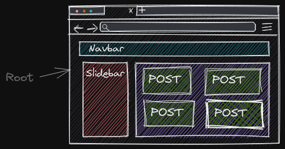

#Notas del curso de React

> Martes 25 de Octubre del 2022
>
> Requerimientos:
> - HTML
> - CSS
> - JS => Sobre todo los conceptos básicos e intermedios (bucles, condicionales, métodos de objetos, ES6+, etc.)
> - Node
>
> By Gustavo Angel Montoya Martínez

## ¿Qué es? 

Es una biblioteca de javaScript que nos permite crear interfaces de usuarios, es muy utilizada lo que nos permite usar elementos que otras personas ya hicieron.
Tiene un buen rendimiento, es veloz ya que internamente utiliza *virtual dom*. 
Nos permite crear vistas declarativas, es decir. lo que queremos mostrar en pantalla podemos verlo en el código.
Con *virtual dom* podemos pintar al usuario sin refrescar toda la pantalla y podemos divir una aplicación grande en **componentes**.
React puede ser utiliza desde el servidor.

#### Componentes 

React puede divir una aplicación grande en pequeñas partes.Son denominadas componentes a pequeñas partes que pueden encapsular código HTML, CSS y javaScript que lucen como etiquetas html para poder ser reutilizadas incluso en otro proyectos.

## Crear proyecto de react


Npm es una herramienta que se usa para instalar paquetes. Npx es una herramienta que se usa para ejecutar paquetes.

> Necesitamos instalar NodeJS y desde NodeJS ejecutamos el siguiente comando:

```
npx create-react-app *name_app*
```
#### Comandos 

Ejecutar servidor de desarrollo 

```
npm start
```

Preparar el código a producción
```
npm run build 
```

Hacer test de interfaces 
```
npm test
```

Sacar las configuraciones de create-react-app
```
npm run eject
```

## Componentes 



En React siempre empieza con un componente *root*.Siempre debe haber un componente que contenga el resto.

## Hola mundo

Ejemplo de hola mundo en react

```
import React from "react";
import ReactDom from "react-dom/client";

const root = ReactDom.createRoot(document.getElementById("root"));
root.render(<h1>Hola Mundo</h1>);

```

## Ejemplo de un componente

```
import React from "react";
import ReactDom from "react-dom/client";

const root = ReactDom.createRoot(document.getElementById("root"));

function saludar() {
  return <h1>Este es componente</h1>;
}

root.render(saludar());

```

#### Ejemplo de re-utilización de un componente

```
import React from "react";
import ReactDom from "react-dom/client";

const root = ReactDom.createRoot(document.getElementById("root"));

function saludar() {
  return <h1>Este es componente</h1>;
}

root.render(<div>
    {saludar()}
    {saludar()}
    {saludar()}
    {saludar()}
</div>)
```
> Sí llamamos a los componentes mediante *{}* las funciones pueden empezar con minuscula 

#### Ejemplo de componente (Self Closing Tags)

Cerrar llaves en sí requiere que las funciones empiezen por mayúsuclas

Ejemplo:


```
import React from "react";
import ReactDom from "react-dom/client";

const root = ReactDom.createRoot(document.getElementById("root"));

function Saludar() {
  return <h1>Este es componente</h1>;
}

root.render(<div>
    <Saludar/>
    <Saludar/>
    <Saludar/>
    <Saludar/>
</div>);

```
## JSX

Gracias a JSX podemos combinar HTML con javaScript nativo lo que nos permite trabajar con logica y etiquetas.

Ejemplo:

```
import React from "react";
import ReactDom from "react-dom/client";

const root = ReactDom.createRoot(document.getElementById("root"));

function Saludar() {
    const married = true
  return <h1>{married ? 'Estoy casado' : 'No estoy casado'}</h1>
}

root.render(
    <Saludar />
);
```

Muchas veces queremos muchos componentes el componente *root* va a ir creciendo esto nos lleva un div dentro de un div dentro de otro div, etc.

Para evitar el ecceso de div's podemos utilizar **fragmant** que es un componente vacio.


EJemplo:

```
import React from "react";
import ReactDom from "react-dom/client";

const root = ReactDom.createRoot(document.getElementById("root"));

function Saludar() {
  function add(x, y) {
    return x + y;
  }

  return <h1>{add(10, 10)}</h1>;
}

root.render(
  <>
    <Saludar />
    <Saludar />
    <Saludar />
  </>
);

```


## Exportar 

Para identificar a los componente de React es necesario poner el nombre con la primera letra en mayúsculas.

Exportar individual:

```
function Product() {
  return (
    <div>
      <h1>Producto</h1>
    </div>
  );
}

```
Para importar :

 ```
 import { Greeting} from "./Greeting";

 ```

 Para exportar por default : 
 ```
 function Product() {
  return (
    <div>
      <h1>Producto</h1>
    </div>
  );
}

export default Product;
 ```
 Para importar default : 
 ```
 import Product from "./Product"
```

## Props


Los componentes son funciones en js, es decir, pueden recivir parametros.


Ejemplo:

```
export function User({ name, amount, married, address }) {
  return (
    <div>
      <h1>Name: {name}</h1>
      <h2>💵: {amount}</h2>
      <h2>Estado: {married ? "casado" : "Soltero"}</h2>
      <h2>Addres:</h2>
      <ul>
        <li>city: {address.city}</li>
        <li>street: {address.street}</li>
      </ul>
    </div>
  );
}
```


```
root.render(
  <>
    <User
      name="angel"
      amount={123}
      married={true}
      point={[99, 12, 321]}
      address={{ street: " 123", city: "new york" }}
    />
  </>
);
```

> Nota: Se puede recibir mas de un parametro 

Los datos que revibe puede ser cualquier dato de javaScript 

## EStilos

Estilos en una línea para un componente:

```
export function TaskCard(){
    return <div style={{background:'#000099',color:'#fff'}}>
        <h1 style={{fontWeight:"bolder"}}>Mi primer tarea</h1>
        <p style={{fontFamily:"cursive"}}>Tarea realizada</p>
    </div>
}
```

Se puede obtimizar y mas fácil de leer ya que los estilos son objetos en js.

Ejemplo:

```
export function TaskCard() {

  const divStyle = { background: "#000099", color: "#fff" };
  const h1Style = { fontWeight: "bolder" };
  const pStyle = { fontFamily: "cursive" };
  
  return (
    <div style={divStyle}>
      <h1 style={h1Style}>Mi primer tarea</h1>
      <p style={pStyle}>Tarea realizada</p>
    </div>
  );
}
```

## Tipos de componentes

Hasta el momento hemos visto que para crear componentes se usan funciones pero tambien se pueden hacer usando clases.

> Esto es un tema relacionado a POO 

Ejemplo: 

```
import { Component } from "react";

export class Saludar extends Component {
  render() {
    return <h1>Hello world</h1>;
  }
}

```

> Esta manera todavia esta soportada por React sin embargo es muy poco comun verla
